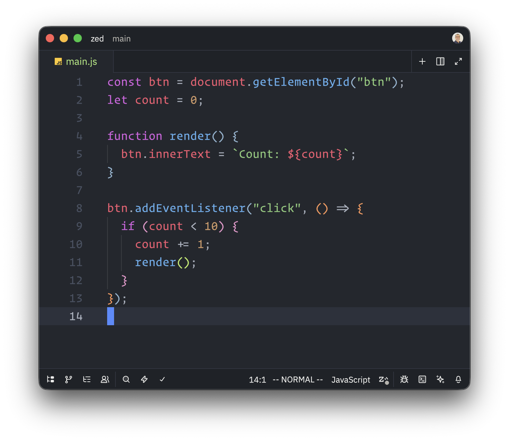
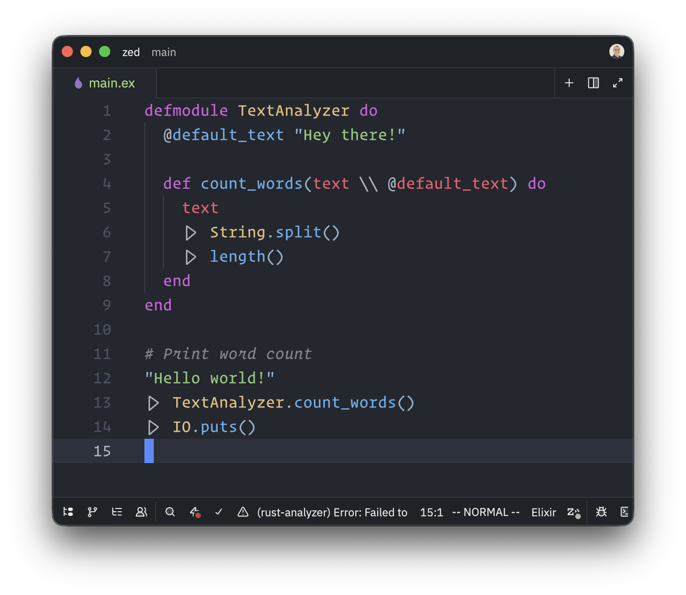
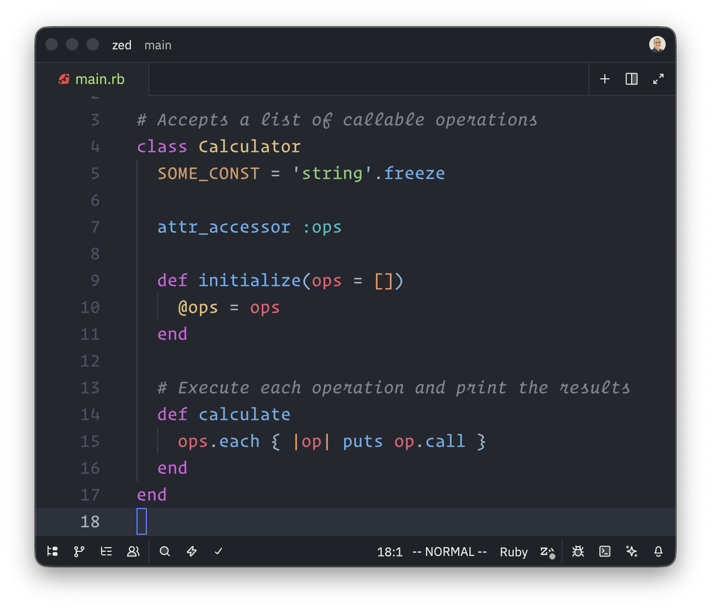
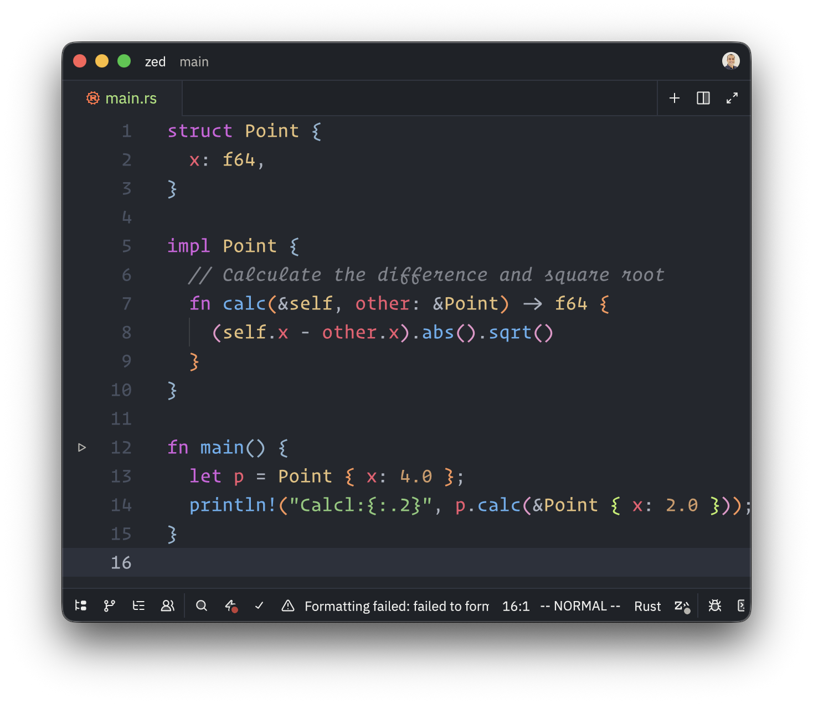
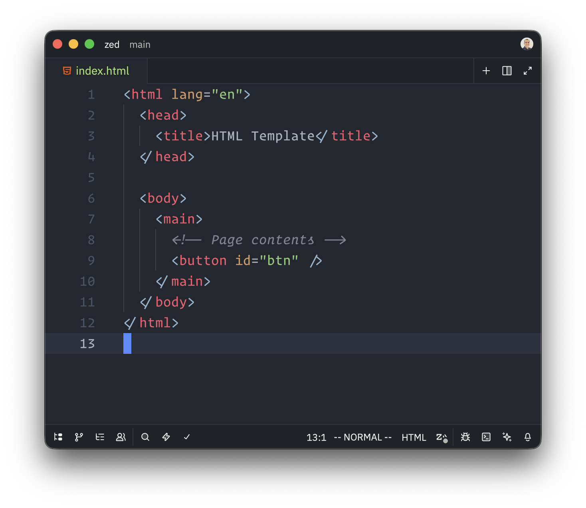
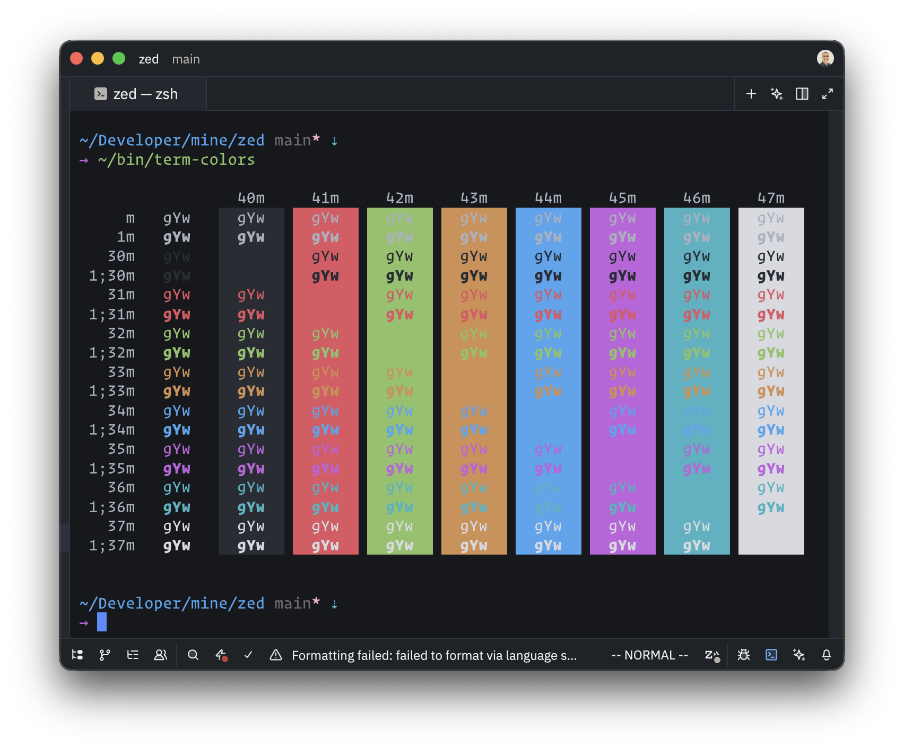

# Zed One Dark Pro Vivid Theme

One Dark Pro theme with vivid colors and improved contrast.

## Screenshots

### JavaScript

### Elixir

### Ruby

### Rust

### HTML

### Terminal

## Acknowledgements

This theme is heavily based on the [Zed One Dark Pro Theme](https://github.com/MordFustang21/zed-one-dark-pro)
with vivid color values taken from the [VSCode One Dark Pro Theme](https://github.com/Binaryify/OneDark-Pro).
